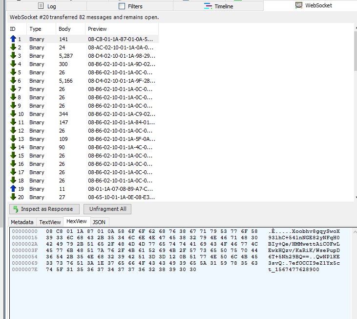
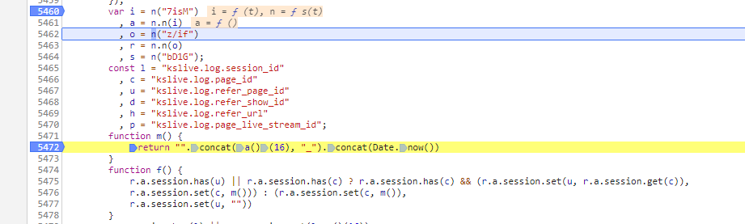
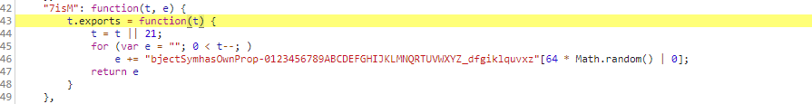
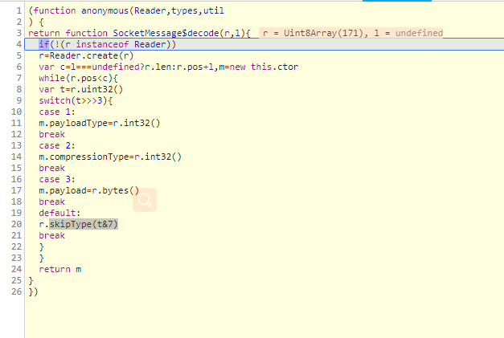
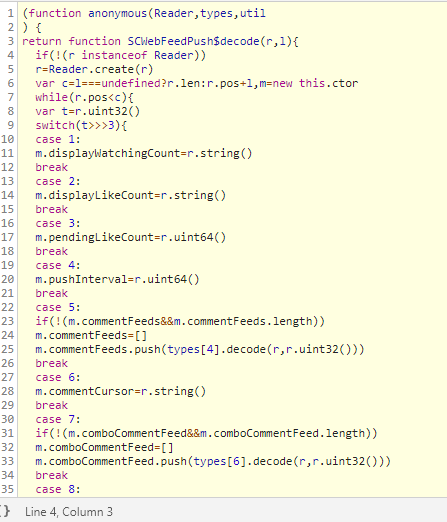
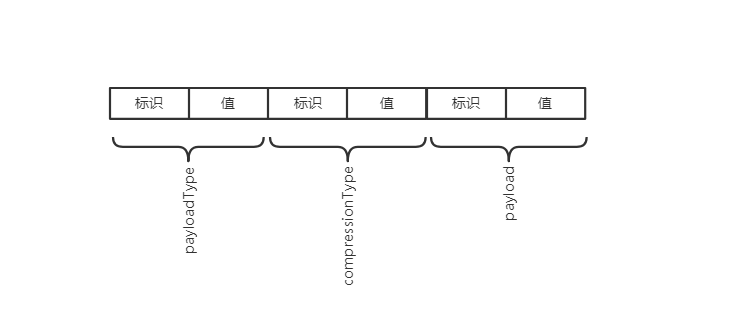
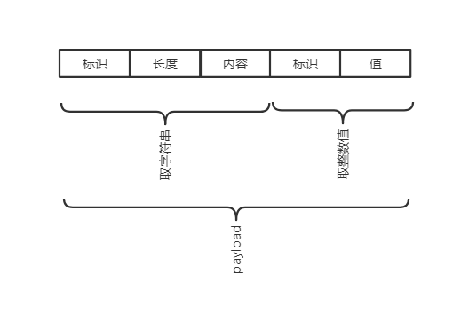

### 逆向快手直播弹幕协议

1. 建立websocket连接

   

   连接地址：wss://live-ws-pg-group3.kuaishou.com/websocket

   首先客户端向服务端发送一次数据告诉服务端要接收哪个房间的弹幕

   ```python
   ȇ
   Xoobhv8gqySwoX93lhC+54lnNGE82yNFqH0BIy+Qe/HMMwettAiCOFwLEwkHQzv/KaRiK/WsePupD6T+5Nh29BQ==QwNPlKE3svQ:7efOCCI9eZ1Yx5ct_1567477628900
   ```

   发现由三个有效数据组成

   token：oobhv8gqySwoX93lhC+54lnNGE82yNFqH0BIy+Qe/HMMwettAiCOFwLEwkHQzv/KaRiK/WsePupD6T+5Nh29BQ==

   stream_id:QwNPlKE3svQ

   page_id:7efOCCI9eZ1Yx5ct_1567477628900

   其中stream_id,page_id保存在浏览器的Session Storage中

   

   token可以在房间页源码找到,即使浏览器清除Session Storage，一段时间里也不会过期。

   page_id的生成：

   

   顺着找到

   

   经测试page_id只要是上面的随机16字符+时间戳就行。

   ```python
   def get_page_id():
       charset = "bjectSymhasOwnProp-0123456789ABCDEFGHIJKLMNQRTUVWXYZ_dfgiklquvxz"
       page_id = ''
       for _ in range(0, 16):
           page_id += random.choice(charset)
       page_id += "_"
       page_id += str(int(time.time()*1000))
       return page_id
   ```

   只剩下stream_id了，在js里没找到怎么生成的，如果有哥么发现了告诉我，谢谢。这里还是通过房间页源码提取。

   服务端知道你要获取哪个房间弹幕，就给你回弹幕数据了。大约每两秒钟客户端要给服务端发送一次心跳。

   也就是说只要替换这三个字段数据就可以爬指定房间弹幕了。

   ```python
   def on_open(ws):
       part1 = [0x08, 0xC8, 0x01, 0x1A, 0x87, 0x01, 0x0A, 0x58]  # 不变的头
       token = "oobhv8gqySwoX93lhC+54lnNGE82yNFqH0BIy+Qe/HMMwettAiCOFwLEwkHQzv/Khhxtm5MNOpR0syxixhAyag=="
       part2 = [ord(c) for c in token]
       part3 = [0x12, 0x0B]  #
       stream_id = "XW35rOrWOs8"
       part4 = [ord(c) for c in stream_id]
       part5 = [0x3A, 0x1E]
       page_id = get_page_id()
       part6 = [ord(c) for c in page_id]
   
       d = part1 + part2 + part3 + part4 + part5 + part6
       ws.send(d, websocket.ABNF.OPCODE_BINARY)
       def run():
               time.sleep(2)
               ws.send([8, 1, 26, 7, 8, 184, 232, 190, 199, 220, 44], websocket.ABNF.OPCODE_BINARY)
       thread.start_new_thread(run, ())
       
   def on_message(ws, message):
       data = [m for m in message]
       print(data)
   ```

   这里收到是十六进制数组，要根据协议解码。下面分析js逆推。

2. 在common..........js里面

   

   对数据decode，追进去

   

   python实现：

   ```python
     def decode(self):
           """只处理弹幕"""
           length = len(self)
           while self.pos < length:
               t = self.int()
               tt = t >> 3
               if tt == 1:
                   self.message['payloadType'] = self.int()
                   if self.message['payloadType'] != 310:  # 非弹幕
                       return False
               elif tt == 2:
                   self.message['compressionType'] = self.int()
               elif tt == 3:
                   self.message['payload'] = self.bytes()
               else:
                   self.skipType(t & 7)
           return True
   ```

   

   第8行，取当前位置的值

   

   uint32,int32,uint64,int64 都用int

   ```python
       def int(self):
        res = 0
        i = 0
        while self.buf[self.pos] > 128:
            res = res | (127 & self.buf[self.pos]) << 7 * i
            self.pos += 1
            i += 1
        res = res | self.buf[self.pos] << 7 * i
        self.pos += 1
        return res
   ```

   

   this.pos 一直移动到小于128的位置,由低位到高位拼接，得到最终值t。继续追，如果消息是SC_FEED_PUSH类型会进入

   

   python实现对payload解码，有一些信息没处理可能造成pos位置错误。

   ```python
       def feed_decode(self):
           self.pos = 0
           self.buf = self.message['payload']
           length = len(self.buf)
           while self.pos < length:
               t = self.int()
               tt = t >> 3
               if tt == 1:
                   self.message['displayWatchingCount'] = self.string()
                   # print("观看人数：" + self.message['displayWatchingCount'])
               elif tt == 2:
                   self.message['displayLikeCount'] = self.string()
                   # print("点赞数：" + self.message['displayLikeCount'])
               elif tt == 5:  # 评论
                   if not self.message.get('user'):
                       self.message['user'] = []
                   self.message['user'].append(self.comment_decode(self.buf, self.int()))
               elif tt == 9:  # 礼物
                   if not self.message.get('gift'):
                       self.message['gift'] = []
                   self.message['gift'].append(self.gift_decode(self.buf, self.int()))
   ```

   同样的套路你又要去实现 gift_decode(),comment_decode(),user_info_decode(),string()。

   原数组组成：

   

   payload组成：

   

3. 完整弹幕解析程序：

   ```python
   class MessageDecode:
       def __init__(self, buf):
           self.buf = buf
           self.pos = 0
           self.message = {}
   
       def __len__(self):
           return len(self.buf)
   
       def int(self):
           res = 0
           i = 0
           while self.buf[self.pos] > 128:
               res = res | (127 & self.buf[self.pos]) << 7 * i
               self.pos += 1
               i += 1
           res = res | self.buf[self.pos] << 7 * i
           self.pos += 1
           return res
   
       def bytes(self):
           e = self.int()
           if e + self.pos > len(self.buf):
               raise Exception('长度不匹配')
           res = self.buf[self.pos:e + self.pos]
           self.pos += e
           return res
   
       def skip(self, e=0):
           """跳过多少字节"""
           if e == 0:
               self.pos = len(self.buf) - 1
               return
           self.pos += e
           if self.pos >= len(self.buf):
               self.pos -= 1
   
       def skipType(self, e):
           if e == 0:
               self.skip()
           elif e == 1:
               self.skip(8)
           elif e == 2:
               self.skip(self.int())
           elif e == 3:
               while True:
                   e = 7 & self.int()
                   if 4 != e:
                       self.skipType(e)
           elif e == 5:
               self.skip(4)
           else:
               raise Exception('跳过类型错误')
   
       def decode(self):
           """只处理弹幕"""
           length = len(self)
           while self.pos < length:
               t = self.int()
               tt = t >> 3
               if tt == 1:
                   self.message['payloadType'] = self.int()
                   if self.message['payloadType'] != 310:  # 非弹幕
                       return False
               elif tt == 2:
                   self.message['compressionType'] = self.int()
               elif tt == 3:
                   self.message['payload'] = self.bytes()
               else:
                   self.skipType(t & 7)
           return True
   
       def string(self):
           e = self.bytes()
           n = len(e)
           if n < 1:
               return ""
           s = []
           t = 0
           while t < n:
               r = e[t]
               t += 1
               if r < 128:
                   s.append(r)
               elif r < 191 < 224:
                   s.append((31 & r) << 6 | 63 & e[t])
                   t += 1
               elif 239 < r < 365:
                   x = (7 & r) << 18 | (63 & e[t]) << 12
                   t += 1
                   y = (63 & e[t]) << 6
                   t += 1
                   z = 63 & e[t]
                   t += 1
                   r = (x | y | z) - 65536
                   s.append(55296 + (r >> 10))
                   s.append(56320 + (1023 & r))
               else:
                   x = (15 & r) << 12
                   y = (63 & e[t]) << 6
                   t += 1
                   z = 63 & e[t]
                   t += 1
                   s.append(x | y | z)
           string = ''
           for w in s:
               try:
                   string += unichr(w)  # python2
               except:
                   string += chr(w)  # python3
           return string
   
       def user_info_decode(self, r, l):
           c = self.pos + l
           m = {}
           while self.pos < c:
               t = self.int()
               tt = t >> 3
               if tt == 1:
                   m['principalId'] = self.string()
               elif tt == 2:
                   m['userName'] = self.string()
               elif tt == 3:
                   m['headUrl'] = self.string()
               else:
                   self.skipType(t & 7)
           return m
   
       def comment_decode(self, r, l):
           c = self.pos + l
           m = {}
           while self.pos < c:
               t = self.int()
               tt = t >> 3
               if tt == 1:
                   m['id'] = self.string()
               elif tt == 2:
                   m['user'] = self.user_info_decode(self.buf, self.int())
               elif tt == 3:
                   m['content'] = self.string()
               elif tt == 4:
                   m['deviceHash'] = self.string()
               elif tt == 5:
                   m['sortRank'] = self.int()
               elif tt == 6:
                   m['color'] = self.string()
               else:
                   self.skipType(t & 7)
           return m
   
       def gift_decode(self, r, l):
           c = self.pos + l
           m = {}
           while self.pos < c:
               t = self.int()
               tt = t >> 3
               if tt == 1:
                   m['id'] = self.string()
               elif tt == 2:
                   m['user'] = self.user_info_decode(self.buf, self.int())
               elif tt == 3:
                   m['time'] = self.int()
               elif tt == 4:
                   m['giftId'] = self.int()
               elif tt == 5:
                   m['sortRank'] = self.int()
               elif tt == 6:
                   m['mergeKey'] = self.string()
               elif tt == 7:
                   m['batchSize'] = self.int()
               elif tt == 8:
                   m['comboCount'] = self.int()
               elif tt == 9:
                   m['rank'] = self.int()
               elif tt == 10:
                   m['expireDuration'] = self.int()
               elif tt == 11:
                   m['clientTimestamp'] = self.int()
               elif tt == 12:
                   m['slotDisplayDuration'] = self.int()
               elif tt == 13:
                   m['starLevel'] = self.int()
               elif tt == 14:
                   m['styleType'] = self.int()
               elif tt == 15:
                   m['liveAssistantType'] = self.int()
               elif tt == 16:
                   m['deviceHash'] = self.string()
               elif tt == 17:
                   m['danmakuDisplay'] = self.bool()
               else:
                   self.skipType(t & 7)
           return m
   
       def feed_decode(self):
           self.pos = 0
           self.buf = self.message['payload']
           length = len(self.buf)
           while self.pos < length:
               t = self.int()
               tt = t >> 3
               if tt == 1:
                   self.message['displayWatchingCount'] = self.string()
                   # print("观看人数：" + self.message['displayWatchingCount'])
               elif tt == 2:
                   self.message['displayLikeCount'] = self.string()
                   # print("点赞数：" + self.message['displayLikeCount'])
               elif tt == 5:
                   if not self.message.get('user'):
                       self.message['user'] = []
                   self.message['user'].append(self.comment_decode(self.buf, self.int()))
               elif tt == 9:  # 礼物
                   if not self.message.get('gift'):
                       self.message['gift'] = []
                   self.message['gift'].append(self.gift_decode(self.buf, self.int()))
   
   
   if __name__ == '__main__':
       m = {"0": 8, "1": 182, "2": 2, "3": 16, "4": 1, "5": 26, "6": 162, "7": 1, "8": 10, "9": 4, "10": 50, "11": 48,
            "12": 48, "13": 43, "14": 18, "15": 4, "16": 49, "17": 54, "18": 55, "19": 50, "20": 74, "21": 76, "22": 18,
            "23": 30, "24": 10, "25": 11, "26": 115, "27": 49, "28": 48, "29": 49, "30": 54, "31": 57, "32": 55, "33": 56,
            "34": 48, "35": 51, "36": 48, "37": 18, "38": 15, "39": 230, "40": 136, "41": 145, "42": 239, "43": 188,
            "44": 140, "45": 232, "46": 142, "47": 177, "48": 239, "49": 188, "50": 140, "51": 228, "52": 185, "53": 159,
            "54": 32, "55": 164, "56": 1, "57": 50, "58": 15, "59": 49, "60": 52, "61": 49, "62": 53, "63": 48, "64": 55,
            "65": 54, "66": 54, "67": 54, "68": 45, "69": 54, "70": 48, "71": 48, "72": 55, "73": 50, "74": 56, "75": 1,
            "76": 64, "77": 1, "78": 72, "79": 1, "80": 80, "81": 224, "82": 167, "83": 18, "84": 96, "85": 232, "86": 7,
            "87": 130, "88": 1, "89": 8, "90": 68, "91": 82, "92": 111, "93": 67, "94": 70, "95": 119, "96": 61, "97": 61,
            "98": 74, "99": 70, "100": 18, "101": 24, "102": 10, "103": 11, "104": 68, "105": 68, "106": 55, "107": 53,
            "108": 51, "109": 49, "110": 49, "111": 52, "112": 55, "113": 56, "114": 52, "115": 18, "116": 9, "117": 230,
            "118": 136, "119": 180, "120": 230, "121": 157, "122": 177, "123": 230, "124": 157, "125": 177, "126": 32,
            "127": 164, "128": 1, "129": 50, "130": 15, "131": 55, "132": 53, "133": 51, "134": 49, "135": 49, "136": 52,
            "137": 55, "138": 56, "139": 52, "140": 45, "141": 49, "142": 48, "143": 54, "144": 53, "145": 51, "146": 56,
            "147": 1, "148": 64, "149": 1, "150": 72, "151": 1, "152": 80, "153": 224, "154": 167, "155": 18, "156": 96,
            "157": 232, "158": 7, "159": 130, "160": 1, "161": 8, "162": 56, "163": 47, "164": 106, "165": 43, "166": 89,
            "167": 103, "168": 61, "169": 61, "170": 32, "171": 240, "172": 218, "173": 176, "174": 165, "175": 207,
            "176": 45}
       message = MessageDecode(list(m.values()))
       if message.decode():
           message.feed_decode()
           if message.message.get('gift'):
               print('收到礼物：')
               print(message.message.get('gift'))
           elif message.message.get('user'):
               print('收到弹幕：')
               print(message.message.get('user'))
               
              
   
   
   ```

   
